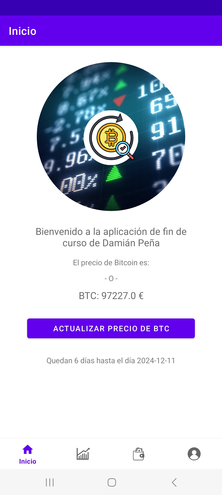
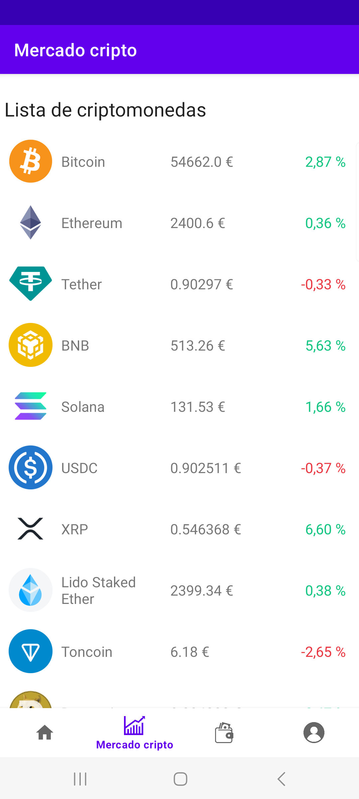
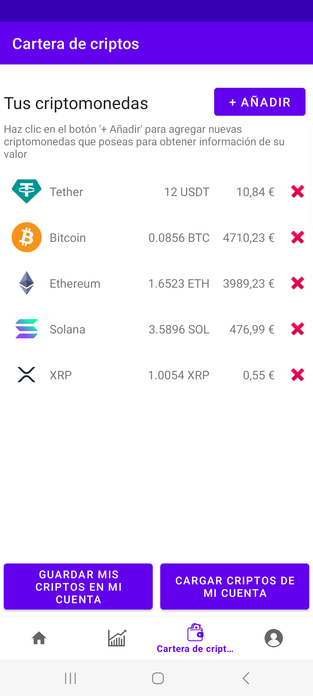
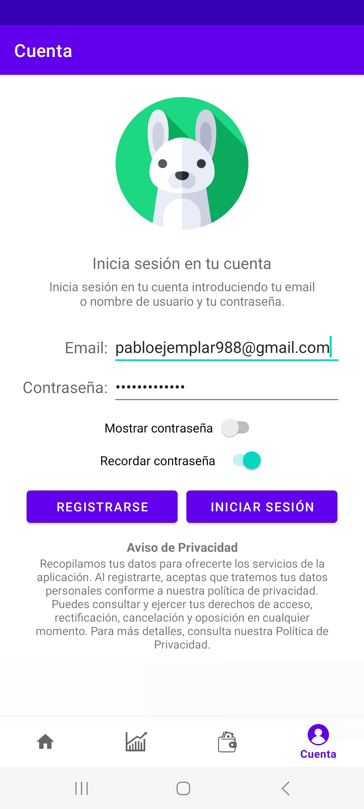
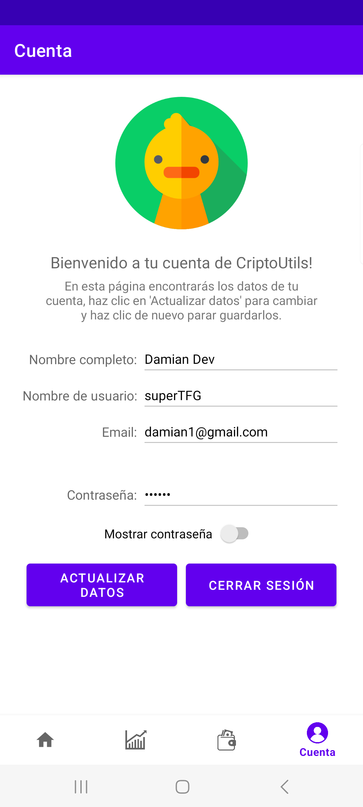
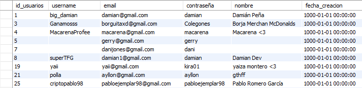
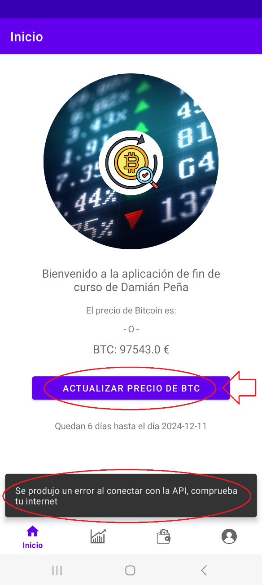
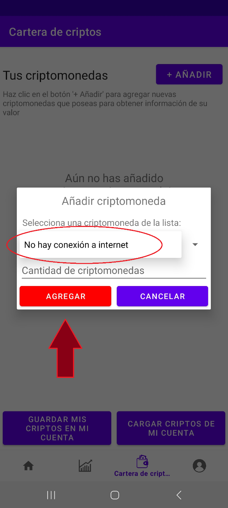
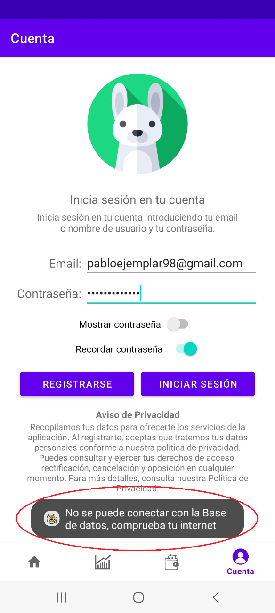

 
 

  

# Cripto Utilidades Damian, a crypto Android application for my TFG (Bachelor´s Degree Final Project)

Cripto Utilidades Damian is an Android app developed as part of my Bachelor’s Degree Final Project (TFG). It provides users with a list of up-to-date cryptocurrencies and basic data using the [CoinGecko API](https://docs.coingecko.com/reference/introduction), along with detailed information based on the [CoinMarketCap website](https://coinmarketcap.com/). Users can add cryptocurrencies from the updated CoinGecko list to their wallet to track their value in euros. Additionally, you can log in to your account and update your user information.

## Gantt chart

|                    Gantt chart                     |
|:--------------------------------------------------:|
|  |

## App Details

## User Stories

- [x] The user can see the list of cryptocurrencies from the CoinGecko API and see some basic information (using a RecyclerView).
- [x] Progressively load more list items (and their icon) by scrolling down the list (Using dynamic loading through API and image load with Glide).
- [x] The user can see updated info about the cryptocurrencies through a WebView connected to CoinMarketCap.
- [x] The user can save his own crypto into a wallet to track their value (Using SQLite).
- [x] The user can log into his account, create a new one and edit some basic user data once he has logged in (Using a online MySQL database).
- [x] The user can backup his crypto to his account through the cloud and restore them (Using SQLite and MySQL databases).
- [x] User's email and password will be remembered in the login screen if "remember password is selected" (SQLite).
- [x] The user can see how many days are left until first of September (TFG delivery date) in the home screen.
- [x] The user can stay logged in if "remember password is selected" (auto-login).
- [ ] The user can see 3 crypto currencies in the home screen.
- [ ] The user can search crypto in the crypto list.

### Screenshots

  |                               Home screen                               |                        Market screen (Crypto List)                        |                         Wallet screen (Tracking)                          |                                 Account screen                                  |
  |:-----------------------------------------------------------------------:|:-------------------------------------------------------------------------:|:-------------------------------------------------------------------------:|:-------------------------------------------------------------------------------:|
  |  |  |  |  |

### User Registration

  |                                Log in + sign in                                 |                                  Logged in                                  |
  |:-------------------------------------------------------------------------------:|:---------------------------------------------------------------------------:|
  |  |  |

## Screen flow

  |                                    Screen flow diagram                                    |
  |:-----------------------------------------------------------------------------------------:|
  |  |

## Database data strucutre

The application's database is implemented using MySQL, featuring two main tables: one for user account management and login, and another for storing users' cryptocurrencies. 
These are screenshots/visual representation of each table

  |                                 Users table                                 |                               User's crypto wallet                               |
  |:---------------------------------------------------------------------------:|:--------------------------------------------------------------------------------:|
  |  |  |

## Managing Exceptions and Unexpected Situations

Possible exceptions have been handled with try-catch structures. The app relies heavily on a internet connection but still works showing some offline data and shows messages for when there is no internet connection while running the app. 
Here is some examples of error messages showing up when there's no internet:

  |                             Home screen (no internet)                              |                      Market screen (Crypto List) (no internet)                      |                 Wallet screen (Tracking) (trying to add zero coins)                  |                                Account screen (no internet)                                |
  |:----------------------------------------------------------------------------------:|:-----------------------------------------------------------------------------------:|:------------------------------------------------------------------------------------:|:------------------------------------------------------------------------------------------:|
  |  |  |  |  |

## Conclussion

The project successfully met its goals of providing a cryptocurrency portfolio management tool with real-time data, interactive charts, and market news for my TFG. Previous experience with Java enabled a confident approach while learning new technologies. 
This enriching experience strengthened technical skills and project management capabilities, fostering interest in mobile development and innovative applications in the growing cryptocurrency market.

## Libraries Used

* [Data Binding] - Declaratively bind observable data to UI elements.
* [ViewModel] - Store UI-related data that isn't destroyed on app rotations. Easily schedule
* [SQLiteOpenHelper] - Access your app's SQLite database.
* [MySQL (java.sql -> DriverManager)] - To connect to remote MySQL database for login
  asynchronous tasks for optimal execution.
* [Volley] for making HTTP requests
* [Glide] for image loading
* [Retrofit] for dynamic loading a recyclerview from api (combined with Glide for images)

## Personal data law compliance

To comply with the [General Data Protection Regulation (Regulation (EU) 2016/679)](https://en.wikipedia.org/wiki/General_Data_Protection_Regulation), a diclaimer was added to the login screen under the buttons (although no real Privacy Policy exsits).

## Useful links and resources
These are some of the main resources and API's I used to make this project possible: 
- [CoinGecko API](https://docs.coingecko.com/reference/introduction)
- [CoinMarketCap website](https://coinmarketcap.com/about/)
- [CleverCloud MySQL free service](https://www.clever-cloud.com/product/mysql/)
- [diagrams.net for flow diagram creation](https://app.diagrams.net/)

## Copyright and license

**Copyright © 2024 Damián Peña-Marín Samaniego.** 
This work is licensed under a **Creative Commons**: 
**Attribution-NonCommercial-ShareAlike 4.0 International License (CC BY-NC-SA 4.0)**
