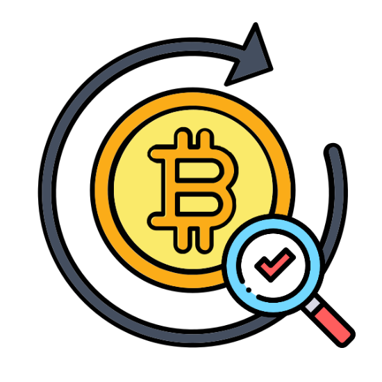
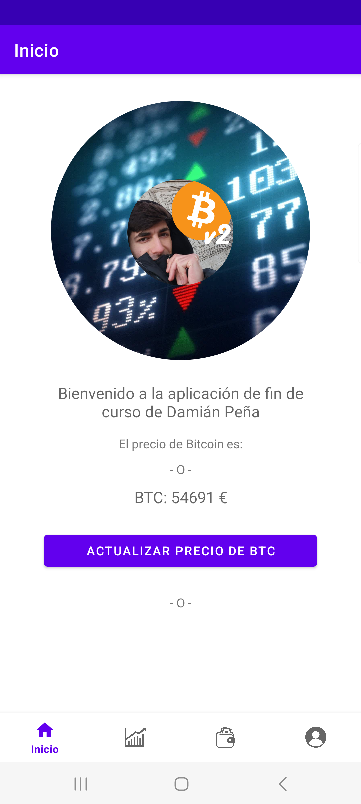
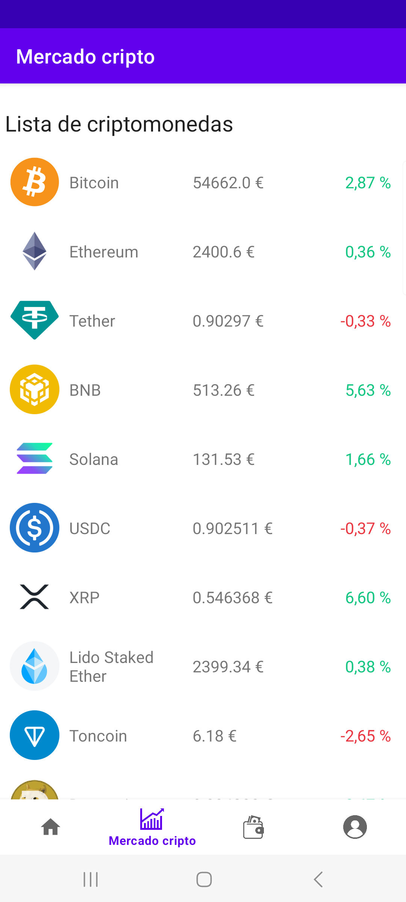
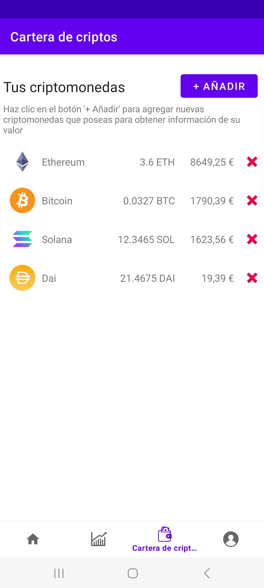
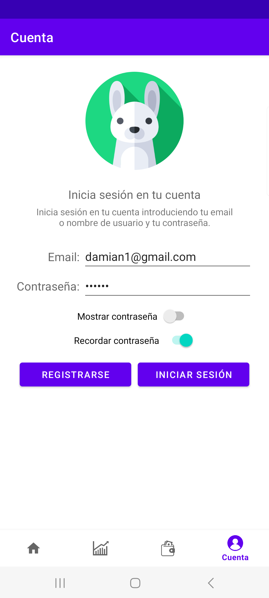
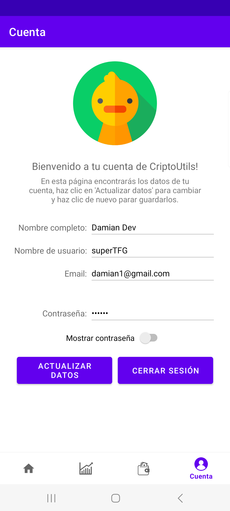

  - This README.md is uncompleted, work in progress -

  

# Cripto Utilidades Damian, a crypto Android application for my TFG (Bachelor´s Degree Final Project)

Cripto Utilidades Damian is an Android app developed as part of my Bachelor’s Degree Final Project (TFG). It provides users with a list of up-to-date cryptocurrencies and basic data using the CoinGecko API, along with detailed information based on the CoinMarketCap website. Users can add cryptocurrencies from the updated CoinGecko list to their wallet to track their value in euros. Additionally, you can log in to your account and update your user information.

## Libraries Used

* [Data Binding] - Declaratively bind observable data to UI elements.
* [ViewModel] - Store UI-related data that isn't destroyed on app rotations. Easily schedule
* [SQLiteOpenHelper] - Access your app's SQLite database.
* [MySQL (java.sql -> DriverManager)] - To connect to remote MySQL database for login
  asynchronous tasks for optimal execution.
* [Volley] for making HTTP requests
* [Glide] for image loading
* [Retrofit] for dynamic loading a recyclerview from api (combined with Glide for images)

## User Stories

- [ ] The user can see the list of cryptocurrencies from the CoinGecko API and see some basic information.
- [ ] Progressively load more list items (and their icon) by scrolling down the list.
- [ ] The user can see updated info about the cryptocurrencies through a WebView connected to CoinMarketCap(https://coinmarketcap.com/).
- [ ] The user can save his own crypto into a wallet to track their value.
- [ ] The user can log into his account, create a new one and edit some basic user data once he has logged in.

## App Details

### Screenshots

|                           Home screen                            |                    Market screen (Crypto List)                     |                      Wallet/Tracking screen                        |                             Account screen                               |
|:----------------------------------------------------------------:|:------------------------------------------------------------------:|:------------------------------------------------------------------:|:------------------------------------------------------------------------:|
|  |  |  |  |

### User Registration

|                             Log in + sign in                             |                              Logged in                               |
|:------------------------------------------------------------------------:|:--------------------------------------------------------------------:|
|  |  |

## Useful links and resources
- [Example link](https://github.com/big-damian/Cripto_Utilidades_Damian)
